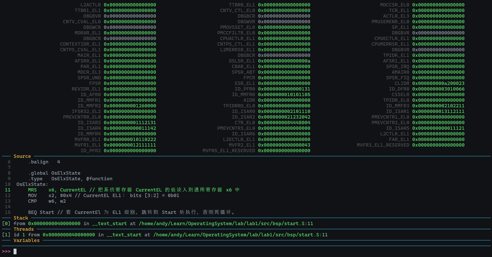
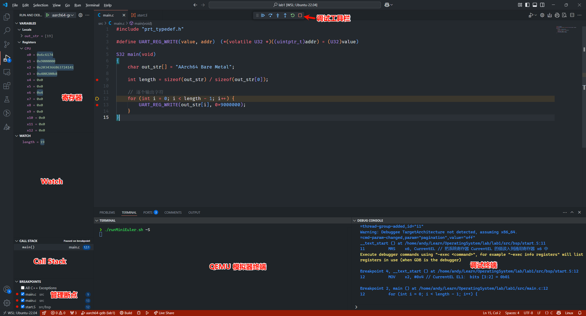

# 实验一 环境配置报告
AnicoderAndy
<!-- @import "[TOC]" {cmd="toc" depthFrom=2 depthTo=4 orderedList=false} -->

<!-- code_chunk_output -->

- [实验环境](#实验环境)
- [实验过程](#实验过程)
  - [安装工具链](#安装工具链)
    - [安装交叉编译工具链](#安装交叉编译工具链)
    - [安装 QEMU 模拟器](#安装-qemu-模拟器)
  - [创建裸机程序](#创建裸机程序)
  - [工程构建与调试支持](#工程构建与调试支持)
- [作业](#作业)
  - [作业 1](#作业-1)
  - [作业 2](#作业-2)
    - [Compile 类](#compile-类)
    - [程序入口](#程序入口)
  - [作业 3](#作业-3)
- [心得体会](#心得体会)

<!-- /code_chunk_output -->


## 实验环境
操作系统环境：`microsoft-standard-WSL2 x86_64 GNU/Linux`

Ubuntu 版本：
```
Distributor ID: Ubuntu
Description:    Ubuntu 22.04.5 LTS
Release:        22.04
Codename:       jammy
```
## 实验过程
### 安装工具链
#### 安装交叉编译工具链
```bash
❯ wget https://developer.arm.com/-/media/Files/downloads/gnu/11.2-2022.02/binrel/gcc-arm-11.2-2022.02-x86_64-aarch64-none-elf.tar.xz
❯ tar -xf gcc-arm-11.2-2022.02-x86_64-aarch64-none-elf.tar.xz
❯ mv gcc-arm-11.2-2022.02-x86_64-aarch64-none-elf.tar.xz aarch64-none-elf
```

经过这些步骤，将 `aarch64-none-elf/bin` 文件夹添加到 PATH 中，安装成功：
```
❯ aarch64-none-elf-gcc --version
aarch64-none-elf-gcc (GNU Toolchain for the Arm Architecture 11.2-2022.02 (arm-11.14)) 11.2.1 20220111
Copyright (C) 2021 Free Software Foundation, Inc.
This is free software; see the source for copying conditions.  There is NO
warranty; not even for MERCHANTABILITY or FITNESS FOR A PARTICULAR PURPOSE.
```

该版本的 `gdb` 依赖 Python3.6，还需要从 Python 官网下载 Python3.6 源代码并将其编译。

#### 安装 QEMU 模拟器
```
❯ sudo apt-get update
❯ sudo apt-get install qemu
❯ sudo apt-get install qemu-system
```
完成安装。

### 创建裸机程序
建立与实验文档中相同的文件结构，并且创建对应文件：
```bash
❯ tree .
.
├── makeMiniEuler.sh
├── runMiniEuler.sh
└── src
    ├── CMakeLists.txt
    ├── aarch64-qemu.ld
    ├── bsp
    │   ├── CMakeLists.txt
    │   ├── prt_reset_vector.S
    │   └── start.S
    ├── include
    │   └── prt_typedef.h
    └── main.c
```

### 工程构建与调试支持
使用 VS Code 中的 CMake 插件或命令行命令 `cmake src -B build && cmake --build build` 配置并生成可执行文件。

通过 `qemu-system-aarch64 -machine virt -m 1024M -cpu cortex-a53 -nographic -kernel build/miniEuler  -s` 正常运行，输出 `AArch64 Bare Metal`。

在刚刚运行命令最后添加 `-S` 选项使得程序在入口处暂停，新建一个终端窗口打开调试器：`aarch64-none-elf-gdb build/miniEuler`。

在调试器中输入 `target remote localhost:1234` 即可连接到 QEMU 模拟器进行调试。

将这一版本的 `gdb` 添加到 VS Code 项目调试配置文件中：
```json
{
    "version": "0.2.0",
    "configurations": [
        {
            "name": "aarch64-gdb",
            "type": "cppdbg",
            "request": "launch",
            "program": "${workspaceFolder}/build/miniEuler",
            "stopAtEntry": true,
            "cwd": "${fileDirname}",
            "environment": [],
            "externalConsole": false,
            "launchCompleteCommand": "exec-run",
            "MIMode": "gdb",
            "miDebuggerPath": "/home/andy/Kits/aarch64-none-elf/bin/aarch64-none-elf-gdb",
            "miDebuggerServerAddress": "localhost:1234",
            "miDebuggerArgs": "-q -nh", // 关闭启动信息；不调用.gitinit。
            "setupCommands": [
                {
                    "description": "Enable pretty-printing for gdb",
                    "text": "-enable-pretty-printing",
                    "ignoreFailures": false
                }
            ]
        }
    ],

}
```

按照实验文档编写自动化脚本 `makeMiniEuler.sh` 和 `runMiniEuler.sh`，并通过 `chmod u+x` 命令添加运行权限。通过执行 `./<script name>` 即可运行对应脚本。

## 作业
### 作业 1
比较 *`CMP w6, w2` 前后 `NZCV` 寄存器的变化：*

由于系统寄存器 `NZCV` 寄存器存在一些读写限制，不能方便地直接通过 gdb 读取，所以修改 `start.S` 代码，在 `CMP w6, w2` 命令前后添加 `MRS x25, NZCV` 指令将该寄存器的值暂存至 `x25` 以便观察：

```armasm
MRS    x25, NZCV
CMP    w6, w2
MRS    x25, NZCV
```

启动调试比较 `CMP` 语句执行前后的值：

- before：
- after: 

发现 `NZCV` 中的 `CARRY FLAG` 和 `ZERO FLAG` 被置为 `1`，符合预期（因为补码视角下 `CMP` 指令会产生进位，最终结果为 `0`）。

### 作业 2
*分析 UniProton 的构建系统：*

阅读 [UniProton 项目仓库](https://gitee.com/openeuler/UniProton)下的 `build.py` 文件，了解 UniProton 的构建系统。

首先该文件定义了 `Compile` 类，作为整个构建过程的核心。整个构建流程主要分为以下几个阶段：

1. 准备环境（通过 `prepare_env` 从配置文件中获取编译环境参数）
2. 调用 CMake 生成对应 Makefile
3. 调用 `make` 方法实现代码编译和安装

该文件中还提供了多平台与多编译选项支持。多平台支持方面，通过 Python 内置的 `platform.uname()` 判断当前构建平台，如在 riscv64 平台上还会特殊处理编译器路径。此外，在 `getOsPlatform` 方法中区分了 arm64 和 x86 平台。编译选项方面，根据传入的编译选项（fortify、hllt 或 normal），`build.py` 会构造不同的 CMake 命令。

下面逐段分析该文件。

#### Compile 类
```py
def get_config(self, cpu_type, cpu_plat):
    self.compile_mode = get_compile_mode()
    self.lib_type, self.plam_type, self.hcc_path, self.kconf_dir, self.system, self.core = get_cpu_info(cpu_type, cpu_plat, self.build_machine_platform)
    if platform.uname()[-1] == 'riscv64':
        self.hcc_path = os.path.dirname(
            subprocess.check_output(['which', 'gcc'], text=True).strip()
        )
    if not self.compile_mode and self.lib_type and self.plam_type and self.hcc_path and self.kconf_dir:
        log_msg('error', 'load config.xml env error')
        sys.exit(0)
    self.config_file_path = '%s/build/uniproton_config/config_%s'%(self.home_path, self.kconf_dir)

    self.objcopy_path = self.hcc_path

def setCmdEnv(self):
    self.build_time_tag = time.strftime('%Y-%m-%d_%H:%M:00')
    self.log_dir = '%s/logs/%s' % (self.build_dir, self.cpu_type)
    self.log_file = '%s.log' % self.kconf_dir

def SetCMakeEnviron(self):
    os.environ["CPU_TYPE"] = self.cpu_type
    os.environ["PLAM_TYPE"] = self.plam_type
    os.environ["LIB_TYPE"] = self.lib_type
    os.environ["COMPILE_OPTION"] = self.compile_option
    os.environ["HCC_PATH"] = self.hcc_path
    os.environ["UNIPROTON_PACKING_PATH"] = self.UniProton_packing_path
    os.environ["CONFIG_FILE_PATH"] = self.config_file_path
    os.environ["LIB_RUN_TYPE"] = self.lib_run_type
    os.environ["HOME_PATH"] = self.home_path
    os.environ["COMPILE_MODE"] = self.compile_mode
    os.environ["BUILD_MACHINE_PLATFORM"] = self.build_machine_platform
    os.environ["SYSTEM"] = self.system
    os.environ["CORE"] = self.core
    os.environ["OBJCOPY_PATH"] = self.objcopy_path
    os.environ['PATH'] = '%s:%s' % (self.hcc_path, os.getenv('PATH'))

# 环境准备，准备执行cmake，make，makebuildfile，CmakeList需要的环境
# 每次compile之前请调用该函数
def prepare_env(self, cpu_type, choice):
    # makebuildfile需要的环境kconf_dir
    # cmake需要的环境cmake_env_path，home_path（cmakelist所在的路径）,home_path,
    # make cmd拼接需要的环境：home_path,UniProton_make_jx,log_dir,log_file，build_time_tag， UniProton_make_jx

    #根据cpu_type, choice从config文件中获取并初始化初始化hcc_path， plam_type, kconf_dir
    #根据输入分支获取
    #从编译镜像环境获取
    self.get_config(cpu_type, choice)
    self.setCmdEnv()
    self.SetCMakeEnviron()
```
这四个方法用于准备 `cmake` 等指令的环境。 `get_config` 方法可以获取并且设置系统的基本信息以及用户输入的配置选项，`setCmdEnv` 方法则配置了命令行的基本环境，`SetCmakeEnviron` 则为 CMake 构建设置了相应环境。

```py
# 获取当前编译的路径信息，配置文件信息，编译选项信息
def __init__(self, cpu_type: str, make_option="normal", lib_run_type="FPGA", choice="ALL", make_phase="ALL",
                UniProton_packing_path=""):
    # 当前路径信息
    self.system = ""
    self.objcopy_path = ""
    self.builder = None
    self.compile_mode = ""
    self.core = ""
    self.plam_type = ""
    self.kconf_dir = ""
    self.build_tmp_dir = ""
    self.log_dir = ""
    self.lib_type = ""
    self.hcc_path = ""
    self.log_file = ""
    self.config_file_path = ""
    self.build_time_tag = ""
    self.build_dir = globle.build_dir
    self.home_path = globle.home_path
    self.kbuild_path = globle.kbuild_path
    # 当前选项信息
    self.cpu_type = cpu_type
    self.compile_option = make_option
    self.lib_run_type = lib_run_type
    self.make_choice = choice.lower()
    self.make_phase = make_phase
    self.UniProton_packing_path = UniProton_packing_path if make_phase == "CREATE_CMAKE_FILE" else '%s/output'%self.home_path
    self.UniProton_binary_dir = os.getenv('RPROTON_BINARY_DIR')
    self.UniProton_install_file_option = os.getenv('RPROTON_INSTALL_FILE_OPTION')
    self.UniProton_make_jx = 'VERBOSE=1' if self.UniProton_install_file_option == 'SUPER_BUILD' else 'VERBOSE=1 -j' + str(os.cpu_count())
    # 当前编译平台信息
    self.getOsPlatform()
```
这是 `Compile` 类的构造函数，会初始化用户输入的编译选项并且获取当前操作系统等信息。

```py
#调用cmake生成Makefile文件，需要
def CMake(self):
    if self.UniProton_binary_dir:
        self.build_tmp_dir = '%s/output/tmp/%s' % (self.UniProton_binary_dir, self.kconf_dir)
    else:
        self.build_tmp_dir = '%s/output/tmp/%s' % (self.build_dir, self.kconf_dir)
    os.environ['BUILD_TMP_DIR'] = self.build_tmp_dir

    if not os.path.exists(self.build_tmp_dir):
        os.makedirs(self.build_tmp_dir)
    if not os.path.exists(self.log_dir):
        os.makedirs(self.log_dir)

    log_msg('info', 'BUILD_TIME_TAG %s' % self.build_time_tag)
    self.builder = BuilderNolog(os.path.join(self.log_dir, self.log_file))
    if self.make_phase in ['CREATE_CMAKE_FILE', 'ALL']:
        real_path = os.path.realpath(self.build_tmp_dir)
        if os.path.exists(real_path):
            shutil.rmtree(real_path)
        os.makedirs(self.build_tmp_dir)
        #拼接cmake命令
        if self.compile_option == 'fortify':
            cmd = '%s/cmake %s -DCMAKE_TOOLCHAIN_FILE=%s/cmake/tool_chain/uniproton_tool_chain.cmake ' \
                    '-DCMAKE_C_COMPILER_LAUNCHER="sourceanalyzer;-b;%sproject" ' \
                    '-DCMAKE_INSTALL_PREFIX=%s &> %s/%s' % (
            self.cmake_env_path, self.home_path, self.home_path, self.cpu_type,
            self.UniProton_packing_path, self.log_dir, self.log_file)
        elif self.compile_option == 'hllt':
            cmd = '%s/cmake %s -DCMAKE_TOOLCHAIN_FILE=%s/cmake/tool_chain/uniproton_tool_chain.cmake ' \
                    '-DCMAKE_C_COMPILER_LAUNCHER="lltwrapper" -DCMAKE_INSTALL_PREFIX=%s &> %s/%s' % (
            self.cmake_env_path, self.home_path, self.home_path, self.UniProton_packing_path, self.log_dir, self.log_file)
        else:
            cmd = '%s/cmake %s -DCMAKE_TOOLCHAIN_FILE=%s/cmake/tool_chain/uniproton_tool_chain.cmake ' \
                    '-DCMAKE_INSTALL_PREFIX=%s &> %s/%s' % (
            self.cmake_env_path, self.home_path, self.home_path, self.UniProton_packing_path, self.log_dir, self.log_file)
        #执行cmake命令
        if self.builder.run(cmd, cwd=self.build_tmp_dir, env=None):
            log_msg('error', 'generate makefile failed!')
            return False

    log_msg('info', 'generate makefile succeed.')
    return True
```
该方法会根据用户输入的编译选项以及捕获到的系统信息，调用 cmake 指令生成 `makefile`。

```py
def make(self):
    if self.make_phase in ['EXECUTING_MAKE', 'ALL']:
        self.builder.run('make clean', cwd=self.build_tmp_dir, env=None)
        tmp = sys.argv
        if self.builder.run(
                'make all %s &>> %s/%s' % (
                self.UniProton_make_jx, self.log_dir, self.log_file), cwd=self.build_tmp_dir, env=None):
            log_msg('error', 'make %s %s  failed!' % (self.cpu_type, self.plam_type))
            return False
        sys.argv = tmp
        if self.compile_option in ['normal', 'coverity', 'single']:
            if self.builder.run('make install %s &>> %s/%s' % (self.UniProton_make_jx, self.log_dir, self.log_file), cwd=self.build_tmp_dir, env=None):
                log_msg('error', 'make install failed!')
                return False
        if os.path.exists('%s/%s' % (self.log_dir, self.log_file)):
            self.builder.log_format()
    
    log_msg('info', 'make %s %s succeed.' % (self.cpu_type, self.plam_type))
    return True
```
该方法会执行 `make` 指令并且安装编译好的文件。

```py
def SdkCompaile(self)->bool:
    # 判断该环境中是否需要编译
    if self.hcc_path == 'None':
        return True

    self.MakeBuildef()
    if self.CMake() and self.make():
        log_msg('info', 'make %s %s lib succeed!' % (self.cpu_type, self.make_choice))
        return True
    else:
        log_msg('info', 'make %s %s lib failed!' % (self.cpu_type, self.make_choice))
        return False

# 对外函数，调用后根据类初始化时的值进行编译
def UniProtonCompile(self):
    #清除UniProton缓存
    if self.cpu_type == 'clean':
        log_msg('info', 'UniProton clean')
        return self.UniProton_clean()
    # 根据cpu的编译平台配置相应的编译环境。
    if self.make_choice == "all":
        for make_choice in globle.cpu_plat[self.cpu_type]:
            self.prepare_env(self.cpu_type, make_choice)
            if not self.SdkCompaile():
                return False
    else:
        self.prepare_env(self.cpu_type, self.make_choice)
        if not self.SdkCompaile():
            return False
    return True

def MakeBuildef(self):

    if not make_buildef(globle.home_path,self.kconf_dir,"CREATE"):
        sys.exit(1)
    log_msg('info', 'make_buildef_file.sh %s successfully.' % self.kconf_dir)
```
`SdkCompaile` 方法负责构建 SDK（软件开发工具包），它会调用 `MakeBuildef` 进行构建。​这段代码中还展示了该类的对外函数 `UniProtonCompile`。

#### 程序入口
```py
# argv[1]: cpu_plat 表示要编译的平台：
# argv[2]: compile_option 控制编译选项，调用不同的cmake参数，目前只有normal coverity hllt fortify single(是否编译安全c，组件化独立构建需求)
# argv[3]: lib_run_type lib库要跑的平台 faga sim等
# argv[4]: make_choice 
# argv[5]: make_phase 全量构建选项
# argv[6]: UniProton_packing_path lib库的安装位置
if __name__ == "__main__":
    default_para = ("all", "normal", "FPGA", "ALL", "ALL", "")
    if len(argv) == 1:
        para = [default_para[i] for i in range(0, len(default_para))]
    else:
        para = [argv[i+1] if i < len(argv) - 1 else default_para[i] for i in range(0,len(default_para))]

    cur_cpu_type = para[0].lower()
    cur_compile_option = para[1].lower()
    cur_lib_run_type = para[2]
    cur_make_choice = para[3]
    cur_make_phase = para[4]
    cur_UniProton_packing_path = para[5]
    for plat in globle.cpus_[cur_cpu_type]:
        UniProton_build = Compile(plat, cur_compile_option, cur_lib_run_type, cur_make_choice, cur_make_phase, cur_UniProton_packing_path)
        if not UniProton_build.UniProtonCompile():
            sys.exit(1)
    sys.exit(0)
```
入口处首先解析执行程序时输入的选项，然后根据这些选项创建 `Compile` 对象并且调用其构建函数。

### 作业 3
*学习如何调试项目：*

通过运行 `./runMiniEuler.sh -S` 启动 QEMU 模拟器并且在入口处暂停，接下来运行 `aarch64-none-elf-gdb build/miniEuler` 启动调试器并且使用 `target remote localhost:1234` 连接到 QEMU 开放的端口进行调试。在 `.gdbinit` 文件中加载 `gdb-dashboard` 脚本后可以使调试界面更美观：



常用命令包括 `b`（设置断点），`n`（执行下一条指令）等。

同时可以使用先前配置好的 VS Code 集成调试环境。先在集成终端中输入 `./runMiniEuler.sh -S`，然后在要调试的文件中点击调试按钮，选择配置好的调试选项 `aarch64-gdb` 即可启动调试，在调试终端输入 `-exec <gdb command>` 即可执行 gdb 命令。

通过 VS Code 添加断点后也可以使用图形界面调试。



## 心得体会
通过本实验，我学习到了如何在 Ubuntu 上配置交叉编译环境，使用 QEMU 模拟器进行裸机程序调试，并且了解了 UniProton 的构建系统。同时也学习到了如何使用 VS Code 的集成调试环境进行调试。

实验过程中遇到了 gdb 缺少 libpython 库的问题，查阅资料发现提供的 gdb 版本必须使用 Python3.6 的库，通过下载 Python3.6 源代码并编译安装解决了这个问题。

另外配置 VS Code 调试环境时，通过在调整 `launch.json` 中的 `"miDebuggerArgs": "-q -nh"`，关闭 gdb 启动时提示，并且要求其在 VS Code 中调试时不调用 `.gitinit`，避免 gdb 插件在 VS Code 终端中输出乱码。

总的来说，这次实验让我对 Linux 系统的使用有了更深入的了解，尤其是在交叉编译和裸机调试方面。通过实践，我也提高了使用命令行和脚本自动化操作的能力，这对后续的实验和项目开发都非常有帮助。