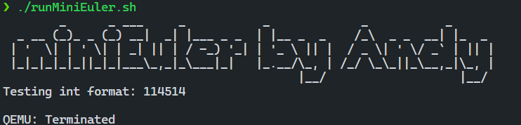

# 实验二 Hello, miniEuler 报告
AnicoderAndy

<!-- @import "[TOC]" {cmd="toc" depthFrom=2 depthTo=6 orderedList=false} -->

<!-- code_chunk_output -->

- [实验过程](#实验过程)
  - [了解 virt 机器](#了解-virt-机器)
  - [实现 PRT_Printf](#实现-prt_printf)
  - [调用 PRT_Printf](#调用-prt_printf)
- [作业](#作业)
  - [作业 1](#作业-1)
- [心得体会](#心得体会)

<!-- /code_chunk_output -->


## 实验过程
### 了解 virt 机器
通过 QEMU 导出设备树并且转换成可读格式。

```bash
qemu-system-aarch64 -machine virt,dumpdtb=virt.dtb -cpu cortex-a53 -nographic
dtc -I dtb -O dts -o virt.dts virt.dtb
```

在 `virt.dts` 可以找到如下内容：

```
pl011@9000000 {
    clock-names = "uartclk\0apb_pclk";
    clocks = <0x8000 0x8000>;
    interrupts = <0x00 0x01 0x04>;
    reg = <0x00 0x9000000 0x00 0x1000>;
    compatible = "arm,pl011\0arm,primecell";
};

chosen {
    stdout-path = "/pl011@9000000";
    kaslr-seed = <0xcbd0568d 0xb463306c>;
};
```

可以看到 virt 选择使用 `pl011` 这一串口（UART）设备作为标准输出。

### 实现 PRT_Printf
新建 `src/bsp/print.c` 并且加入代码：

```c
#include "prt_typedef.h"
#include <stdarg.h>

#define UART_0_REG_BASE 0x09000000 // pl011 设备寄存器地址
// 寄存器及其位定义参见：https://developer.arm.com/documentation/ddi0183/g/programmers-model/summary-of-registers
#define DW_UART_THR 0x00        // UARTDR(Data Register) 寄存器
#define DW_UART_FR 0x18         // UARTFR(Flag Register) 寄存器
#define DW_UART_LCR_HR 0x2c     // UARTLCR_H(Line Control Register) 寄存器
#define DW_XFIFO_NOT_FULL 0x020 // 发送缓冲区满置位
#define DW_FIFO_ENABLE 0x10     // 启用发送和接收FIFO

#define UART_BUSY_TIMEOUT 1000000
#define OS_MAX_SHOW_LEN 0x200

#define UART_REG_READ(addr)                                                    \
    (*(volatile U32 *)(((uintptr_t)addr))) // 读设备寄存器
#define UART_REG_WRITE(value, addr)                                            \
    (*(volatile U32 *)((uintptr_t)addr) = (U32)value) // 写设备寄存器

U32 PRT_UartInit(void) {
    U32 result = 0;
    U32 reg_base = UART_0_REG_BASE;
    // LCR寄存器：
    // https://developer.arm.com/documentation/ddi0183/g/programmers-model/register-descriptions/line-control-register--uartlcr-h?lang=en
    result = UART_REG_READ((unsigned long)(reg_base + DW_UART_LCR_HR));
    UART_REG_WRITE(result | DW_FIFO_ENABLE,
                   (unsigned long)(reg_base + DW_UART_LCR_HR)); // 启用 FIFO

    return OS_OK;
}

// 读 reg_base + offset 寄存器的值。 uartno 参数未使用
S32 uart_reg_read(S32 uartno, U32 offset, U32 *val) {
    S32 ret;
    U32 reg_base = UART_0_REG_BASE;

    *val = UART_REG_READ((unsigned long)(reg_base + offset));
    return OS_OK;
}

// 通过检查 FR 寄存器的标志位确定发送缓冲是否满，满时返回1.
S32 uart_is_txfifo_full(S32 uartno) {
    S32 ret;
    U32 usr = 0;

    ret = uart_reg_read(uartno, DW_UART_FR, &usr);
    if (ret) {
        return OS_OK;
    }

    return (usr & DW_XFIFO_NOT_FULL);
}

// 往 reg_base + offset 寄存器中写入值 val。
void uart_reg_write(S32 uartno, U32 offset, U32 val) {
    S32 ret;
    U32 reg_base = UART_0_REG_BASE;

    UART_REG_WRITE(val, (unsigned long)(reg_base + offset));
    return;
}

// 通过轮询的方式发送字符到串口
void uart_poll_send(unsigned char ch) {

    S32 timeout = 0;
    S32 max_timeout = UART_BUSY_TIMEOUT;

    // 轮询发送缓冲区是否满
    int result = uart_is_txfifo_full(0);
    while (result) {
        timeout++;
        if (timeout >= max_timeout) {
            return;
        }
        result = uart_is_txfifo_full(0);
    }

    // 如果缓冲区没满，通过往数据寄存器写入数据发送字符到串口
    uart_reg_write(0, DW_UART_THR, (U32)(U8)ch);
    return;
}

// 轮询的方式发送字符到串口，且转义换行符
void TryPutc(unsigned char ch) {
    uart_poll_send(ch);
    if (ch == '\n') {
        uart_poll_send('\r');
    }
}

extern int vsnprintf_s(char *buff, int buff_size, int count, char const *fmt,
                       va_list arg);
int TryPrintf(const char *format, va_list vaList) {
    int len;
    char buff[OS_MAX_SHOW_LEN];
    for (int i = 0; i < OS_MAX_SHOW_LEN; i++) {
        buff[i] = 0;
    }
    char *str = buff;

    len = vsnprintf_s(buff, OS_MAX_SHOW_LEN, OS_MAX_SHOW_LEN, format, vaList);
    if (len == -1) {
        return len;
    }

    while (*str != '\0') {
        TryPutc(*str);
        str++;
    }

    return OS_OK;
}

U32 PRT_Printf(const char *format, ...) {
    va_list vaList;
    S32 count;

    va_start(vaList, format);
    count = TryPrintf(format, vaList);
    va_end(vaList);

    return count;
}
```

代码首先定义了后续会用到的宏，例如 `UART_0_REG_BASE`。接着定义了初始化函数 `PRT_UartInit` 用于在保留 `UART_LCR_H` 原有配置的基础上启用 FIFO。定义 `uart_is_txfifo_full` 函数用于通过访问 `DW_UART_FR` 检查缓冲区是否已满。然后定义了 `uart_poll_send` 函数，该函数轮询发送缓冲区是否满的检查，直到缓冲区有空位时将字符发送给 `UART` 设备。随后定义的 `TryPutc` 会使用 `uart_poll_send` 尝试发送单个字符，`TryPrintf` 则在调用外部定义的 `vsnprintf_s` 解析格式化字符串后循环调用 `TryPutc` 输出字符串。`PRT_Printf` 是提供给外部调用的输出函数。

因为本次生成的二进制文件中需要调用浮点数单元，所以还需要在 `start.S` 中启用 FPU：
```armasm
Start:
    LDR    x1, =__os_sys_sp_end // ld文件中定义，堆栈设置
    BIC    sp, x1, #0xf

Enable_FPU:
    MRS X1, CPACR_EL1
    ORR X1, X1, #(0x3 << 20)
    MSR CPACR_EL1, X1
    ISB

    B      OsEnterMain
```

将该新文件以及[实验文档中的 `vsnprintf_s.c`](https://os2024lab.readthedocs.io/zh-cn/latest/_static/vsnprintf_s.c) 纳入 `bsp` 目录下的 `CMakeLists.txt`。

```cmake
set(SRCS start.S prt_reset_vector.S print.c vsnprintf_s.c)
add_library(bsp OBJECT ${SRCS})  # OBJECT类型只编译生成.o目标文件，但不实际链接成库
```

### 调用 PRT_Printf
在 `main` 函数中调用 PRT_Printf 输出 banner，并尝试格式化输出整数。

```c
S32 main(void)
{
    PRT_UartInit();

    const char* banner[5] = {
        "        _      _ ___     _           _             _           _      \n",
        "  _ __ (_)_ _ (_) __|  _| |___ _ _  | |__ _  _    /_\\  _ _  __| |_  _ \n",
        " | '  \\| | ' \\| | _| || | / -_) '_| | '_ \\ || |  / _ \\| ' \\/ _` | || |\n",
        " |_|_|_|_|_||_|_|___\\_,_|_\\___|_|   |_.__/\\_, | /_/ \\_\\_||_\\__,_|\\_, |\n",
        "                                          |__/                   |__/ \n"
    };

    for (int i = 0; i < 5; i++) {
        PRT_Printf("%s", banner[i]);
    }

    PRT_Printf("Testing int format: %d\n\n", 114514);
}
```

运行模拟器，程序正常输出：



## 作业
### 作业 1
*不使用 FIFO 缓冲区实现 `printf`：*

查阅 [`UARTLCR_H` 文档](https://developer.arm.com/documentation/ddi0183/g/programmers-model/register-descriptions/line-control-register--uartlcr-h)后了解到 FIFO 使能在 `UARTLCR_H` 寄存器中位于第 4 位。根据该文档中提供的复位值可知该寄存器上电时的初值为 `0x00`。结合先前的代码可以知道，只要不对 `UARTLCR_H` 寄存器做修改即可禁用 FIFO。

阅读 [`UARTFR` 寄存器](https://developer.arm.com/documentation/ddi0183/g/programmers-model/register-descriptions/flag-register--uartfr)、[`UARTDR` 寄存器](https://developer.arm.com/documentation/ddi0183/g/programmers-model/register-descriptions/data-register--uartdr?lang=en)的文档可知开启与关闭 FIFO 的情形下，缓冲区已满标志和数据传输位的位置都是相同的，所以不需要修改相关逻辑。

综上所述，如果不使用 FIFO，`PRT_UartInit` 函数仅需返回 `OS_OK` 即可，无需修改寄存器值，其他函数均无需修改。

```c
#ifdef PRINT_NO_FIFO
U32 PRT_UartInit(void) { return OS_OK; }
#endif
```

同时需要把原来的 `PRT_UartInit` 函数包裹在未定义 `PRINT_NO_FIFO` 宏情形的预处理语句中。在 `main.c` 中定义 `PRINT_NO_FIFO` 即可禁用 FIFO。

## 心得体会
我通过本次实验在操作系统中加入了一个简单的打印函数，虽然实现的功能很简单，但我在实现过程中学习了如何使用 ARM 汇编语言访问设备寄存器，了解了 `UART` 设备的工作原理。我还通过查阅 ARM 官方文档了解了 `UART` 设备的寄存器结构和位定义，提升了我的文档阅读能力。总而言之，通过本次实验，我对操作系统的底层实现有了更深刻的理解。