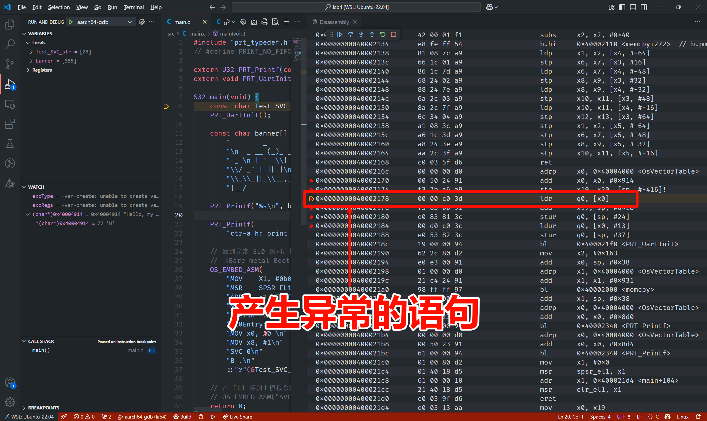
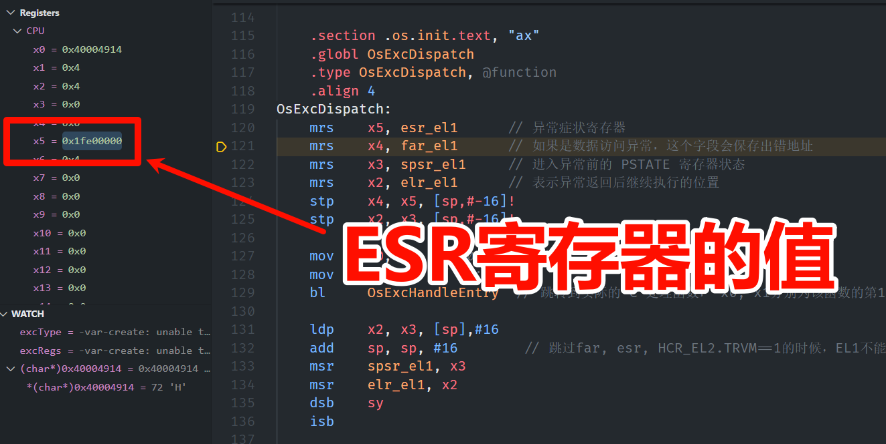

# 实验四 异常处理 报告
AnicoderAndy

<!-- @import "[TOC]" {cmd="toc" depthFrom=2 depthTo=6 orderedList=false} -->

<!-- code_chunk_output -->

- [实验过程](#实验过程)
- [作业](#作业)
  - [作业 1](#作业-1)
- [心得体会](#心得体会)

<!-- /code_chunk_output -->


## 实验过程
首先了解到 ARM 架构下异常处理表一般分为 16 个表项，按照实验文档编写异常处理表文件 `src/bsp/prt_vector.S`：
```armasm
.global OsExcHandleEntry
.type   OsExcHandleEntry, function

.macro SAVE_EXC_REGS  // 保存通用寄存器的值到栈中
    stp    x1, x0, [sp,#-16]!
    stp    x3, x2, [sp,#-16]!
    stp    x5, x4, [sp,#-16]!
    stp    x7, x6, [sp,#-16]!
    stp    x9, x8, [sp,#-16]!
    stp    x11, x10, [sp,#-16]!
    stp    x13, x12, [sp,#-16]!
    stp    x15, x14, [sp,#-16]!
    stp    x17, x16, [sp,#-16]!
    stp    x19, x18, [sp,#-16]!
    stp    x21, x20, [sp,#-16]!
    stp    x23, x22, [sp,#-16]!
    stp    x25, x24, [sp,#-16]!
    stp    x27, x26, [sp,#-16]!
    stp    x29, x28, [sp,#-16]!
    stp    xzr, x30, [sp,#-16]!
.endm

.macro RESTORE_EXC_REGS  // 从栈中恢复通用寄存器的值
    ldp    xzr, x30, [sp],#16
    ldp    x29, x28, [sp],#16
    ldp    x27, x26, [sp],#16
    ldp    x25, x24, [sp],#16
    ldp    x23, x22, [sp],#16
    ldp    x21, x20, [sp],#16
    ldp    x19, x18, [sp],#16
    ldp    x17, x16, [sp],#16
    ldp    x15, x14, [sp],#16
    ldp    x13, x12, [sp],#16
    ldp    x11, x10, [sp],#16
    ldp    x9, x8, [sp],#16
    ldp    x7, x6, [sp],#16
    ldp    x5, x4, [sp],#16
    ldp    x3, x2, [sp],#16
    ldp    x1, x0, [sp],#16
.endm

.macro EXC_HANDLE vecId handler
    SAVE_EXC_REGS // 保存寄存器宏

    mov x1, #\vecId // x1 记录异常类型
    b   \handler // 跳转到异常处理
.endm

    .section .os.vector.text, "ax"

    .global  OsVectorTable
    .type  OsVectorTable,function

    .align 13

OsVectorTable:
.set    VBAR, OsVectorTable
.org VBAR                                // Synchronous, Current EL with SP_EL0
    EXC_HANDLE  0 OsExcDispatch

.org (VBAR + 0x80)                       // IRQ/vIRQ, Current EL with SP_EL0
    EXC_HANDLE  1 OsExcDispatch

.org (VBAR + 0x100)                      // FIQ/vFIQ, Current EL with SP_EL0
    EXC_HANDLE  2 OsExcDispatch

.org (VBAR + 0x180)                      // SERROR, Current EL with SP_EL0
    EXC_HANDLE  3 OsExcDispatch

.org (VBAR + 0x200)                      // Synchronous, Current EL with SP_ELx
    EXC_HANDLE  4 OsExcDispatch

.org (VBAR + 0x280)                      // IRQ/vIRQ, Current EL with SP_ELx
    EXC_HANDLE  5 OsExcDispatch

.org (VBAR + 0x300)                      // FIQ/vFIQ, Current EL with SP_ELx
    EXC_HANDLE  6 OsExcDispatch

.org (VBAR + 0x380)                      // SERROR, Current EL with SP_ELx
    EXC_HANDLE  7 OsExcDispatch

.org (VBAR + 0x400)                      // Synchronous, EL changes and the target EL is using AArch64
    EXC_HANDLE  8 OsExcDispatchFromLowEl

.org (VBAR + 0x480)                      // IRQ/vIRQ, EL changes and the target EL is using AArch64
    EXC_HANDLE  9 OsExcDispatch

.org (VBAR + 0x500)                      // FIQ/vFIQ, EL changes and the target EL is using AArch64
    EXC_HANDLE  10 OsExcDispatch

.org (VBAR + 0x580)                      // SERROR, EL changes and the target EL is using AArch64
    EXC_HANDLE  11 OsExcDispatch

.org (VBAR + 0x600)                      // Synchronous, L changes and the target EL is using AArch32
    EXC_HANDLE  12 OsExcDispatch

.org (VBAR + 0x680)                      // IRQ/vIRQ, EL changes and the target EL is using AArch32
    EXC_HANDLE  13 OsExcDispatch

.org (VBAR + 0x700)                      // FIQ/vFIQ, EL changes and the target EL is using AArch32
    EXC_HANDLE  14 OsExcDispatch

.org (VBAR + 0x780)                      // SERROR, EL changes and the target EL is using AArch32
    EXC_HANDLE  15 OsExcDispatch

    .text

    .global OsExcHandleEntry
    .type   OsExcHandleEntry, function

    .global OsExcHandleEntryFromLowEl
    .type   OsExcHandleEntryFromLowEl, function


    .section .os.init.text, "ax"
    .globl OsExcDispatch
    .type OsExcDispatch, @function
    .align 4
OsExcDispatch:
    mrs    x5, esr_el1      // 异常症状寄存器
    mrs    x4, far_el1      // 如果是数据访问异常，这个字段会保存出错地址
    mrs    x3, spsr_el1     // 进入异常前的 PSTATE 寄存器状态
    mrs    x2, elr_el1      // 表示异常返回后继续执行的位置
    stp    x4, x5, [sp,#-16]!
    stp    x2, x3, [sp,#-16]!

    mov    x0, x1  // x0： 异常类型
    mov    x1, sp  // x1: 栈指针
    bl     OsExcHandleEntry  // 跳转到实际的 C 处理函数， x0, x1分别为该函数的第1，2个参数。

    ldp    x2, x3, [sp],#16
    add    sp, sp, #16        // 跳过far, esr, HCR_EL2.TRVM==1的时候，EL1不能写far, esr
    msr    spsr_el1, x3
    msr    elr_el1, x2
    dsb    sy
    isb

    RESTORE_EXC_REGS // 恢复上下文

    eret //从异常返回


    .globl OsExcDispatchFromLowEl
    .type OsExcDispatchFromLowEl, @function
    .align 4
OsExcDispatchFromLowEl:
    mrs    x5, esr_el1
    mrs    x4, far_el1
    mrs    x3, spsr_el1
    mrs    x2, elr_el1
    stp    x4, x5, [sp,#-16]!
    stp    x2, x3, [sp,#-16]!

    mov    x0, x1
    mov    x1, sp
    bl     OsExcHandleFromLowElEntry

    ldp    x2, x3, [sp],#16
    add    sp, sp, #16        // 跳过far, esr, HCR_EL2.TRVM==1的时候，EL1不能写far, esr
    msr    spsr_el1, x3
    msr    elr_el1, x2
    dsb    sy
    isb

    RESTORE_EXC_REGS // 恢复上下文

    eret //从异常返回
```

本文件确定了每种类型异常对应的代码位置，并且实现了陷入内核前保存寄存器、调用 C 实现的异常处理程序、从陷阱返回时加载寄存器的功能。

在 `src/bsp` 目录下新建 `prt_exc.c` 文件，实现实际的异常处理函数：
```c
#include "os_exc_armv8.h"
#include "prt_typedef.h"

extern U32 PRT_Printf(const char* format, ...);
extern void TryPutc(unsigned char ch);

void MyFirstSyscall(char* str) {
    while (*str != '\0') {
        TryPutc(*str);
        str++;
    }
}

/**
 * @brief 处理系统异常。
 *
 * @param excType 异常类型
 * @param excRegs 格式与 OsExcDispatch 中寄存器存储顺序对应
 */
void OsExcHandleEntry(U32 excType, struct ExcRegInfo* excRegs) {
    PRT_Printf("An exception is caught.\n");
}

/**
 * @brief 处理低级别的系统异常。
 *
 * @param excType 异常类型
 * @param excRegs 格式与 OsExcDispatchFromLowEl 中寄存器存储顺序对应
 */
void OsExcHandleFromLowElEntry(U32 excType, struct ExcRegInfo* excRegs) {
    int ExcClass = (excRegs->esr & 0xfc000000) >> 26;
    if (ExcClass == 0x15) { // SVC instruction execution in AArch64 state.
        PRT_Printf("Catch a SVC call.\n");
        // syscall number存在x8寄存器中，x0为参数1，
        // uniproton存储的顺序x0在高，x30在低
        int syscall_num = excRegs->xregs[(XREGS_NUM - 1) - 8];
        uintptr_t param0 = excRegs->xregs[(XREGS_NUM - 1) - 0];
        PRT_Printf("syscall number: %d, param 0: 0x%x\n", syscall_num, param0);

        switch (syscall_num) {
        case 1:
            MyFirstSyscall((void*)param0);
            break;
        default:
            PRT_Printf("Unimplemented syscall.\n");
        }
    } else {
        PRT_Printf("An exception is caught.\n");
    }
}
```

新建 `src/bsp/os_exc_armv8.h` 文件定义 `excRegs` 类型：
```c
#ifndef ARMV8_EXC_H
#define ARMV8_EXC_H

#include "prt_typedef.h"

#define XREGS_NUM 31

struct ExcRegInfo {
    // 以下字段的内存布局与TskContext保持一致
    uintptr_t elr; // 返回地址
    uintptr_t spsr;
    uintptr_t far;
    uintptr_t esr;
    uintptr_t xzr;
    uintptr_t xregs[XREGS_NUM]; // 0~30 : x30~x0
};

#endif /* ARMV8_EXC_H */
```

在 `main.c` 中添加代码模拟 EL0 级别陷入内核的操作：
```c
const char Test_SVC_str[] = "Hello, my first system call!";
OS_EMBED_ASM(
        "MOV    X1, #0b00000\n" // Determine the EL0 Execution state.
        "MSR    SPSR_EL1, X1\n"
        "ADR    x1, EL0Entry\n" // Points to the first instruction of EL0 code
        "MSR    ELR_EL1, X1\n"
        "eret\n" // 返回到 EL 0 级别
        "EL0Entry: \n"
        "MOV x0, %0 \n" // 参数1
        "MOV x8, #1\n"  // 在linux中,用x8传递 syscall number，保持一致。
        "SVC 0\n"       // 系统调用
        "B .\n"         // 死循环，以上代码只用于演示，EL0级别的栈未正确设置
        ::"r"(&Test_SVC_str[0]));
```

返回 EL0 级别后，通过 `svc` 指令调用了系统号为 `1` 的系统调用。先前在 `prt_exec.c` 中已经实现了该系统调用，它会输出 `参数1` 指向的字符串。

将新增代码纳入构建系统，编译运行得到输出结果：

```
Catch a SVC call.
syscall number: 1, param 0: 0x40024c48
Hello, my first system call!
```

符合预期，可以正常处理异常。

## 作业
### 作业 1
*定位关闭 FPU 时产生异常的原因：*

以 `-S` 参数用 QEMU 启动 miniEuler，在 `main` 函数开头设置断点，逐步调试，发现汇编语句 `ldr q0, [x0]` 处产生异常。



进入异常处理程序，发现触发异常向量表中的 `Synchronous, Current EL with SP_ELx` 表项。



检查当前 ESR_EL1 寄存器的值为 `0x1fe00000`，转为 32 位二进制数为 `0b0001 1111 1110 0000 0000 0000 0000 0000`，参考 ESR_EL1 寄存器[官方文档](https://developer.arm.com/documentation/ddi0601/2023-12/AArch64-Registers/ESR-EL1--Exception-Syndrome-Register--EL1-?lang=en)，检查到高 6 位 `0b000111` 对应文档中的错误：

> Access to SME, SVE, Advanced SIMD or floating-point functionality trapped by CPACR_EL1.FPEN, CPTR_EL2.FPEN, CPTR_EL2.TFP, or CPTR_EL3.TFP control.
> Excludes exceptions resulting from CPACR_EL1 when the value of HCR_EL2.TGE is 1, or because SVE or Advanced SIMD and floating-point are not implemented. These are reported with EC value 0b000000.

也就是说本指令在访问浮点数运算相关寄存器时被 `CPACR_EL1.FPEN` 等寄存器拦截，所以需要开启 FPU，即浮点运算单元来解决这一问题。

继续调试，观察程序如何处理异常。注意到进入异常处理程序后调用了 `PRT_Printf()` 函数，该函数在试图执行汇编指令 `str q0, [sp, #80]` 指令时再次触发和先前相同的异常，再次陷入异常处理程序，导致死循环。

取消注释 FPU 的语句即可避免异常发生。

## 心得体会
本次实验通过异常处理机制实现了对系统调用的处理，了解了异常处理的基本流程和实现方式。通过调试发现了 FPU 关闭时产生异常的原因，并且能够定位到异常发生的代码行。

我通过这次实验对异常处理机制有了更深入的理解，尤其是 ARM 架构下的异常处理流程和寄存器的使用。我学会了通过单步调试定位异常出现位置，并且能够通过分析储存异常信息的寄存器来判断异常的类型和原因。这些技能在后续的操作系统开发中将非常有用。