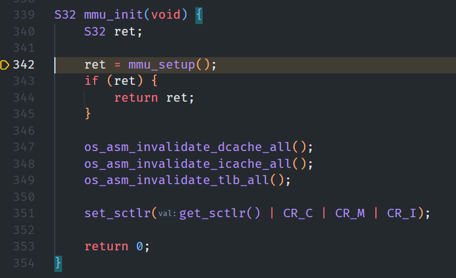
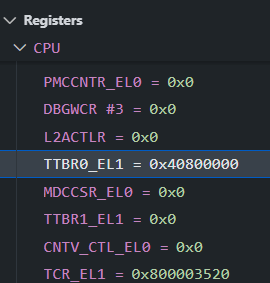

# 实验八 分页内存管理

AnicoderAndy


<!-- @import "[TOC]" {cmd="toc" depthFrom=1 depthTo=6 orderedList=false} -->

<!-- code_chunk_output -->

- [实验八 分页内存管理](#实验八-分页内存管理)
  - [实验过程](#实验过程)
  - [作业](#作业)
  - [心得体会](#心得体会)

<!-- /code_chunk_output -->


## 实验过程

按照实验文档将创建并编译 `mmu.c`、`mmu.h`、`cache_asm.S`。

下面通过调试确保真的启用了 MMU 功能：





注意到在运行 `start.S` 时，程序会跳转到 `mmu_init` 这一 C 函数中完成初始化过程；此函数完成以后 `TTBR0_EL1` 值正常。说明 MMU 功能正常启用。

## 作业

启用 TTBR1 寄存器并映射高地址。

首先设置 `TTBR1_EL1` 寄存器，将 `mmu.c` 中的 `OS_EMBED_ASM("msr ttbr1_el1, %0" : : "r" (table) : "memory");` 取消注释，将表基址写入 `TTBR1_EL1` 寄存器。

然后设置 TTBR1 区域大小（TCR_T1SZ），在 `mmu.h` 中定义宏 `#define TCR_T1SZ(x) ((64 - (x)) << 16)`，接着在 `mmu.c` 中的 `mmu_get_tcr` 中设置完 TCR_T0SZ 的逻辑之后设置 TCR_T1SZ：

```c
tcr |= TCR_T1SZ(va_bits);
```

这样就可以保证 TTBR1 区域大小和 TTBR0 区域大小一致。

下面在 `mmu.c` 中的 `g_mem_map_info` 数组中设置新增外设的高地址映射项（以下代码添加在该数组的末尾）：

```c
    {
        .virt = 0xffffffff08000000, // 高地址空间 UART/GIC 映射起始
        .phys = 0x08000000,         // UART/GIC 物理基地址
        .size = 0x00200000, // 覆盖 0x08000000~0x08100000 范围（2MB 对齐）
        .max_level = 0x2,
        .attrs = MMU_ATTR_DEVICE_NGNRNE | MMU_ACCESS_RW, // 设备类型、可读写
    },
    {
        .virt = 0xffffffff09000000,
        .phys = 0x09000000, // UART 物理基址
        .size = 0x00100000, // 1MB 对齐
        .max_level = 0x2,
        .attrs = MMU_ATTR_DEVICE_NGNRNE | MMU_ACCESS_RW,
    }
```

这会在 TTBR1 映射空间内建立从 `0xffffffff08000000` 和 `0xffffffff09000000` 起的虚拟映射，分别对应物理 `0x08000000` （GIC）和 `0x09000000` （UART）。 `MMU_ATTR_DEVICE_NGNRNE` 保证设备类型映射无缓存， `MMU_ACCESS_RW` 允许读写。

下面在 `print.c` 和 `hwi_init.c` 中修改高地址空间外设的访问方式：

```c
// print.c
#define UART_0_REG_BASE (0xFFFFFFFF00000000UL + 0x09000000UL)

// hwi_init.c
#define GIC_DIST_BASE (0xFFFFFFFF00000000UL + 0x08000000)
#define GIC_CPU_BASE (0xFFFFFFFF00000000UL + 0x08010000)
```

另外还需要注意将 `print.c` 中所有引用 `UART_0_REG_BASE` 的变量类型从 `U32` 改为 `U64`。

至此，已经完成了高地址空间外设的映射过程。

## 心得体会

这次实验从零开始搭建并调试 ARMv8-A 的分页内存管理，让我深刻体会到分页机制背后的设计哲学。通过配置多级页表、设置 TCR_EL1、MAIR_EL1 以及写入 TTBR0/TTBR1 并配合 dsb/isbs 屏障，我看到了硬件如何在指令执行与缓存管理之间建立信任边界。每一步骤看似繁琐，却都环环相扣——只有在页表结构、寄存器配置和缓存一致性得到完整保障后，MMU 才能稳定运行，真正实现虚拟地址到物理地址的映射与保护。

在实践中，我不仅学会了如何在代码中读取并打印系统寄存器值，也学会了在 GDB 环境下实时检查 TTBR 寄存器和 SCTLR_EL1 的位标志。这次动手经验为后续进阶的动态内存分配、进程隔离以及多核一致性打下坚实基础。  